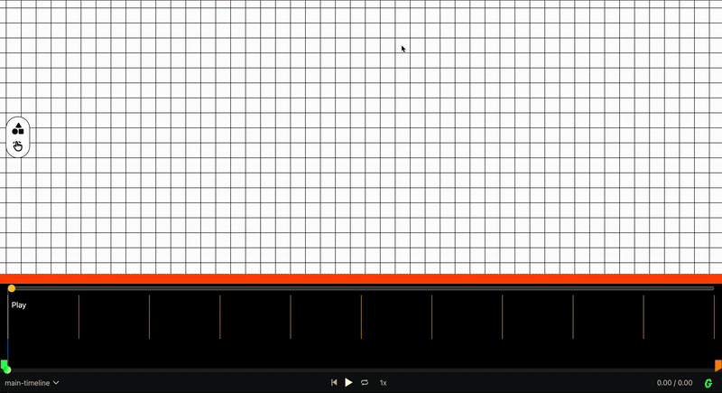
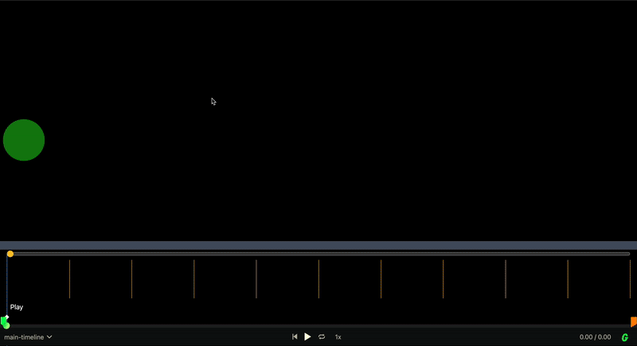

# Notes

<hr />

16/09/2024

- Added support for importing images
- Updated canvas design


14/09/2024

- Switched from recreating timeline for every keyframe to adjusting the timeline dynamically. This caused a bug where after the second keyframe, gsap would jump to the next keyframe without any animation



- The fix for this was to use timeline.invalidate() after adding a keyframe. This removed internally recording and recalculated tweens. [Thanks to Gemini](https://share.google/aimode/d90IQATrmRZCRKkDl)

  - Not so sure how expensive invalidating the entire timeline after  adding a keyframe is, but another option i noticed worked was adding the keyframe as a nested timeline. This worked without needing any timeline invalidation

        ```js
            function addKeyframe (keyframe) {
                timeline.add(
                    timeline.to(
                          konva: keyFrame.animatable,
                          duration: keyFrameDuration,
                          ease: "linear",
                          id: `${keyFrame.timeStamp}`,
                    ),
                    previousKeyFrame.timestamp
                )
            }
        ```

<hr />
12/09/2024

- For some reason when interpolation a color with gsap, when the initial color is a string, Nan is attached to the end

  - This was because the interpolate function of the custom gsap plugin for knova could not interpolate colors. Added a custom function to handle color interpolation. Considered copying code from `React native Reanimated` but that was too much.
